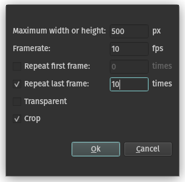

# Animate Views as GIF

This ipelet allows you to create an animated GIF from the views of the current page.

It has been used for the creation of the [Visualization of convex hull algorithms in Ipe](https://github.com/Marian-Braendle/convex-hull-algorithms).

## Settings

## Notes

- For the conversion, an SVG file is created for each view, which is then merged and converted to a GIF file using imagemagick.
- **For Linux Users:** Make sure you have a version of imagemagick with `rsvg` option enabled
